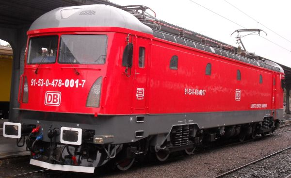
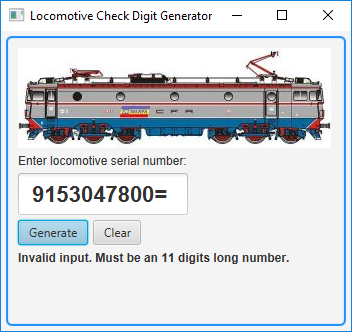
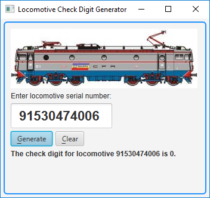

<h1>Locomotive Check Digit Generator Using JavaFX</h1>
<h3>Introduction</h3>
This application calculates the check digit of a locomotive that has a standard UIC (Union Internationale des Chemins de fer – i.e., International Union of Railways) <a href = "http://www.railfaneurope.net/misc/uicnum.html">numbering scheme</a>.
 
According to this standard, a locomotive has a 12 digits long serial number, and the last one is a check digit.
  
For example, we take this Softronic Phoenix locomotive:
  

 
(source of photo: cfr.stfp.net)
 
 
Its full serial number is 915304780017 (the last digit, in this case 7, is the check digit).
  
What this application does is to generate the last digit, after receiving as input the first 11 digits.
  
The application is written using JavaFX, requires at least Java 8 and runs locally.
<h3>Usage examples</h3>
The user has one text input field for the serial number and two buttons: one for submitting the form and obtaining the check digit and one button used for clearing everything.
  
After entering the first 11 digits of the serial number, the user can obtain the 12th one:
  

 
Input is limited to a number of 11 characters. If the user exceeds the limit, the input is automatically shortened to respect the length limit.
  
After the user submits the form, the application validates the input, using a Java regular expression.
  
If the input string does not contain exactly 11 digit characters (0-9), an error message is displayed:
  

 
I would like now to make some remarks about the buttons of the application.
  
JavaFX allows the possibility to set a default button (a button that receives a pressed signal when the user hits Enter key) and a cancel button (a button that receives a pressed signal when the user hits Esc key). This application uses the "Generate" button as default button and the "Clear" button as cancel button. Because it was set as default button, the "Generate" button was automatically given a different color.
  
JavaFX also allows setting mnemonics for buttons. That way, you can push an application button by pressing Alt + a mnemonic key.
 
If you press Alt key inside my application, you will see that some letters on the buttons are getting underlined. Those letters indicate the mnemonics.
 
Alt + G will push the "Generate" button.
 
Alt + C will push the "Clear" button.
 
These key combinations are customized inside the application's code.
  
Another important thing about JavaFX buttons: if you have focus on them and you want to press them using the keyboard, you have to use Spacebar key. This is JavaFX standard behavior.
  
Here you can see the mnemonics set for the buttons:
  

 
<h3>Formula for calculating the check digit</h3>
We multiply each of the 11 digits alternately by 2 and 1 and then we add all the digits of the results.
  
Then, we get the last digit of the sum. If that digit is zero, the check digit will be zero. Otherwise, we subtract the last digit of the sum from 10 and the result will be the check digit.
  
<b>Example:</b>
<table>
<tr>
<td>Locomotive number</td>
<td>91530478001</td>
</tr>
<tr>
<td>Mask</td>
<td>21212121212</td>
</tr>
</table>
Multiply the above arrays, digit by digit => 18 1 10 3 0 4 14 8 0 0 2
 
Add the above digits => 1+8+1+1+0+3+0+4+1+4+8+0+0+2 = 33
 
Get the last digit of the sum => 3
 
Check digit = 10 - &lt;last_digit_of_the_sum&gt; = 10 - 3 = 7
 
Had the last digit of the sum been 0, the check digit would have been 0 (no subtraction from 10 needed in this case).
<h3>How to run the application</h3>
You can run this application in multiple ways:
  
1) From a Development Environment;
 
2) From command line interface;
 
3) Using executable JAR file (included in the GitHub Release, together with instructions on how to use it).
  
This application was developed under Windows 10, using Eclipse Neon (which comes with Java 8), with e(fx)clipse plugin installed (using "Help -> Install New Software" Eclipse menu option). I used a default Java Project wizard, because the JavaFX Project wizard was automatically generating some code and creating a CSS file that I did not need for this particular application. The program can be run from Eclipse using the classic "Run As -> Java Application" option. If you want the picture of the locomotive to be displayed, you need to create "resources" folder on the same level as "src" folder, place the picture (EA060.jpg) inside "resources" folder and then add "resources" folder to the Build Path, as Source Folder (using "Build Path -> Configure Build Path -> Source -> Add folder" menu option).
  
The application can also be compiled and run from the command line, assuming you have at least JDK 8 installed and added to Path variable.
 
Example:
 
D:\Test>javac Locomotive.java
 
D:\Test>java Locomotive
 
(the picture used by the application should be placed in the same folder as the ".class" files)
  
Optionally, you can run also this application by using the provided executable JAR file. You will still need to have at least Java 8 installed.
<h3>The reason for creating this application</h3>
I like trains a lot and I also like photographing them.
  
One day I discovered a site made by someone else, where anyone could upload pictures of locomotives, using a web form. So, I decided to contribute to that site, by sending my pictures.
  
I sent a few pictures, but one day I encountered a problem while uploading one. In the upload form, additional information was required, such as the locomotive's serial number (mandatory field). The user had to manually fill in that number and during the upload processing, validation of that serial number was automatically being done.
  
I had a picture upload rejected because of incorrect locomotive check digit. The funny thing was that the locomotive number I entered was the one written on the locomotive, so I did not make any mistake while manually filling in the web form. The real problem was that the check digit from the serial number written on the locomotive was incorrect. The explanation is that the check digits were manually computed by railway personnel and that resulted in human errors.
  
I had to edit the serial number and replace its last digit (the check digit) with a correct one. Otherwise, the upload would have been rejected. I uploaded the picture and then I wrote an email to the site owner, describing the issue. He replied that there were dozens of locomotives with incorrect check numbers written on them and that he did not expect that when he wrote the code for his webpage. As a result, the standard upload procedure was to use the correct check digit (so that the upload operation would be allowed) instead of the one written on the locomotive, and later the site owner had to edit the serial number in the database and replace the valid check digit with the check digit that was written on the real locomotive. So, priority was given to the check digit written on the locomotive, even if it was incorrect. That gave though the advantage of being able to find pictures of that locomotive by searching its real serial number on the site.
  
I didn't think back then that I should write my own check digit generator, but some years later I thought it would be nice to do so, and since I have been playing with JavaFX recently, I decided to create a JavaFX application that generates a locomotive's check digit.
<h3>Decisions taken during the application development and the reasons behind them</h3>
<b>Limiting user input to a certain length</b>
  
First of all, I needed to limit the	number of characters allowed in the input field. Unfortunately, JavaFX does not offer such a basic option. In HTML, we have "maxlength" attribute, but with JavaFX I had to write code that shortens (truncates) the input if it exceeds a certain length.
  
I added a Listener to the text property of the TextField used for the serial number of the locomotive. That Listener allowed me to execute an action whenever the text in the TextField changed. Inside the Listener I called a method that verifies if the text exceeds the length limit and shortens it to match the maximum allowed length.
  
<b>Choosing where to keep the picture used by the application</b>
  
This application was developed while keeping in mind that it should also be packaged as a JAR executable file, so that a common user could easily run it.
  
The application displays a locomotive's picture, for a more pleasant visual effect. I wanted to keep the picture inside a dedicated folder, named "resources". And I wanted to keep this folder on the same hierarchical level as "src" folder, which contains the Java source code.
  
In my initial approach, I was loading the image by using FileInputStream, with a file path that explicitly included "resources" folder. However, when I was exporting (from Eclipse) the application to a JAR file, "resources" folder was not being created inside the JAR archive, and the picture was being placed directly in the root of the JAR file.
  
Practically, when being run from Eclipse, the application was displaying the picture, but the picture was not being displayed when the application was being run from the JAR file.
  
I did not feel like editing the JAR file (which is actually a ZIP archive) to manually create a "resources" folder inside it and place the picture inside that folder, because it felt like cheating. I wanted the JAR file to be generated by Eclipse and to later remain untouched.
  
So, instead of loading the picture by using FileInputStream, I decided to load it by using "getResourceAsStream" method, which allows finding the picture even if its file name is given without containing the parent folder ("resources"). That is because "resources" folder was added as Source Folder in Eclipse, so Eclipse is able to find the resource (i.e., the picture) even if it is not explicitly being told in the source code that it should look inside "resources" folder. This approach has the advantage of allowing the picture to be found inside the root of a JAR file, because, like previously mentioned, Eclipse wizard does not create "resources" folder inside the JAR file when exporting the application as JAR file, and the picture file is placed directly in the root of the JAR file.
<h3>For Railway fans</h3>
The locomotive whose picture is displayed in the application is an Electroputere LE5100 (also known as EA060), operated by Romanian state owned rail freight company CFR Marf&#259;.
 
The other locomotive (inserted only in this document) is a Softronic Phoenix locomotive, operated by DB Schenker Romania.
  
EA060 locomotives were built in Craiova, Romania, by Electroputere company, under license from Swedish company ASEA. They were produced by Electroputere between 1967 and 1991.
  
Currently, Electroputere company no longer exists, but another company (Softronic) in the same city carries on the legacy of building electric locomotives.
  
Softronic incorporates former Electroputere specialists, as employees and owners. They started by modernizing Electroputere locomotives and based on them, they created new Phoenix (series 471/473/478 of class 47) and Transmontana (class 48) locomotives. Starting with 2017, they began exporting Transmontana locomotives to Green Cargo Swedish company, so the descendent of a locomotive originated in Sweden is back to its ancestor's motherland. 
<h3>Conclusions</h3>
This document explains what this application does, how to run it, why I created it and how it technically works.
  
If there still are authorities where check digit calculation is done by hand, maybe they could use this software solution.
